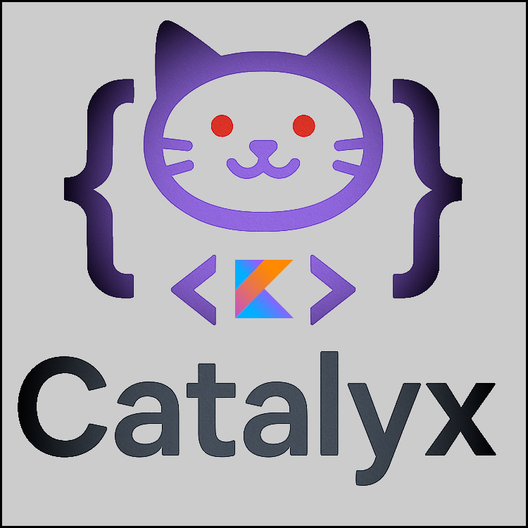

#  Catalyx

<!---freshmark description
output = [
link(shield("Kotlin", "Kotlin", "{{kotlin_version}}", "blue"), "https://kotlinlang.org/"),
link(shield("Maven artifact", "Maven", "{{root_package}}:{{mod_id}}", "blue"), "https://maven.ender-development.org/" + "{{root_package}}/{{mod_id}}/".replaceAll("\\.", "/")),
link(shield("Version", "Version", "{{mod_version}}", "blue"), "{{mod_url}}/commits/master"),
link(shield("License", "License", "LGPL-3.0", "blue"), "{{mod_url}}/blob/master/LICENSE"),
"",
"{{mod_description}}".replace("Kotlin", link("Kotlin", "https://kotlinlang.org/")).replace("Ender-Development's mods", link("Ender-Development's mods", "https://www.curseforge.com/members/enderdevelopment/projects"))
].join("\n")
-->

Catalyx is a library written in [Kotlin](https://kotlinlang.org/) for shared code between [Ender-Development's mods](https://www.curseforge.com/members/enderdevelopment/projects).
<!---freshmark /description -->

## Dependencies

<!---freshmark dependencies
output = [
link(shield("Forgelin-Continuous", "required", "Forgelin-Continuous", "red"), "https://www.curseforge.com/minecraft/mc-mods/forgelin-continuous"),
"",
"Forgelin-Continuous is an updated version of " + link("Shadowfacts' Forgelin", "https://www.curseforge.com/minecraft/mc-mods/shadowfacts-forgelin") + ", which packs latest versions of Kotlin libraries for mod developers to use with."
].join("\n")
-->

Forgelin-Continuous is an updated version of [Shadowfacts' Forgelin](https://www.curseforge.com/minecraft/mc-mods/shadowfacts-forgelin), which packs latest versions of Kotlin libraries for mod developers to use with.
<!---freshmark /dependencies -->

## Contributing

Please make sure to read our [contributing guidelines](.github/CONTRIBUTING.md) first.
Furthermore, you have to agree to our [code of conduct](.github/CODE_OF_CONDUCT.md) if you want to contribute.

## Partnership with Akliz

> It's a pleasure to be partnered with Akliz. Besides being a fantastic server provider, which makes it incredibly easy
> to set up a server of your choice, they help me to push myself and the quality of my projects to the next level.
> Furthermore, you can click on the banner below to get a discount. :')

If you aren't located in the [US](https://www.akliz.net/enderman), Akliz now offers servers in:

- [Europe](https://www.akliz.net/enderman-eu)
- [Oceania](https://www.akliz.net/enderman-oce)

